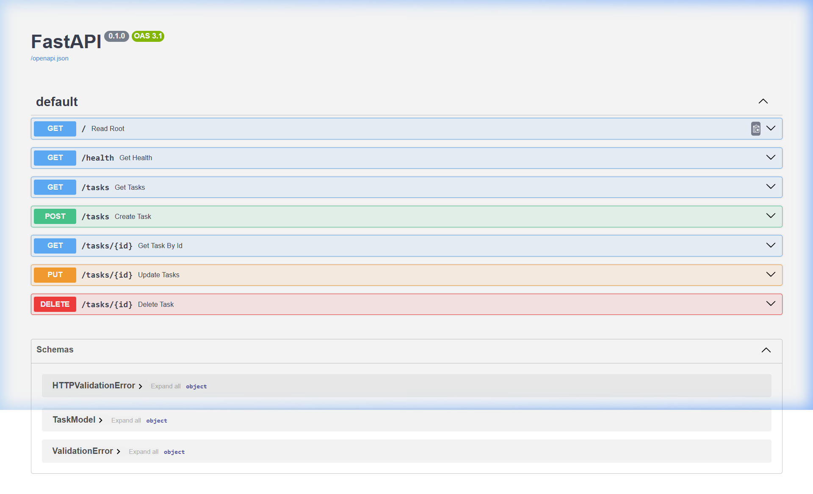

# FastAPI Tasks API

A simple, lightweight RESTful TODO APP API built using **FastAPI** and **Pydantic**. This API supports standard CRUD (Create, Read, Update, Delete) operations on an in-memory task list.

---

## How to Install & Run

You can install all required dependencies and start the local development server with the following single command:

```bash
pip install fastapi uvicorn && uvicorn main:app --reload
```

Make sure to use a virtual environment to download the packages using the following commands:

```bash
python -m venv .venv
.venv\Scripts\activate
```

---

## API Endpoints Reference

| Method     | Endpoint      | Description                                     | Request Body (JSON)                                   | Success Status Code |
| :--------- | :------------ | :---------------------------------------------- | :---------------------------------------------------- | :------------------ |
| **GET**    | `/`           | Retrieve API name, version, and endpoints list. | _None_                                                | `200 OK`            |
| **GET**    | `/health`     | Verify the health status of the service.        | _None_                                                | `200 OK`            |
| **GET**    | `/tasks`      | List all existing tasks.                        | _None_                                                | `200 OK`            |
| **GET**    | `/tasks/{id}` | Retrieve a specific task by its integer ID.     | _None_                                                | `200 OK`            |
| **POST**   | `/tasks`      | Create a new task.                              | `{"title": "string"}`                                 | `201 Created`       |
| **PUT**    | `/tasks/{id}` | Update a task's title and/or completion state.  | `{"title": "string", "done": boolean}` (all optional) | `201 OK`            |
| **DELETE** | `/tasks/{id}` | Delete a task by its ID.                        | _None_                                                | `204 No Content`    |

---

## Sample HTTP Request & Response

Executing a `GET` request to retrieve the tasks list returns:

```http
HTTP/1.1 200 OK
date: Wed, 15 Jul 2026 15:14:15 GMT
server: uvicorn
content-length: 225
content-type: application/json

[{"id":1,"title":"Watch lecture","done":false},{"id":2,"title":"Do assignment","done":true},{"id":3,"title":"Wash dishes","done":true},{"id":4,"title":"Watch World Cup","done":false},{"id":5,"title":"Read book","done":false}]
```

---

## Interactive API Documentation (Swagger UI)

FastAPI automatically generates an interactive documentation page for testing endpoints. Once running, visit:
👉 **[http://127.0.0.1:8000/docs](http://127.0.0.1:8000/docs)**


